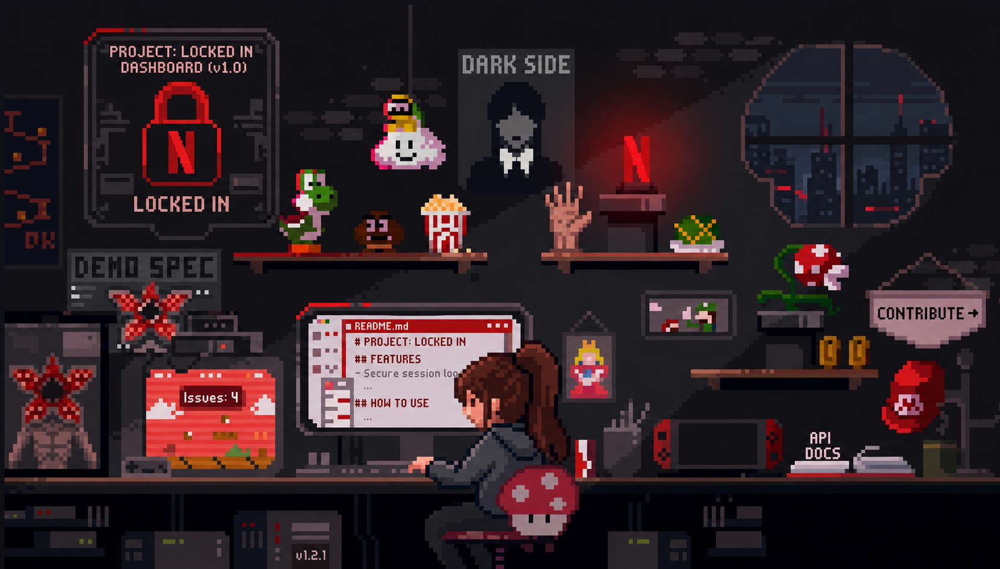

  

## 🧰 Tech Stack

 

**Languages**

 

**Frontend**

 

**Backend & Database**

 

**AI / Tools**

  

## 📊 Contribution Log

 

  

<!-- Snake contribution graph — themed red/black to match the banner -->

💡 To activate the snake graph, add <a href="https://github.com/Platane/snk">platane/snk</a> as a GitHub Action in this repo — it auto-generates <code>github-contribution-grid-snake-dark.svg</code> on the <code>output</code> branch.

  

  

## 📡 Connect

 

  

